# Elvato Architecture Overview

**Status:** Preliminary review draft  
**Purpose:** Source document for the Services dashboard panel hierarchy graph.  
**Last updated:** May 15, 2026

---

## Executive Summary

Elvato is a headless commerce system built around a Medusa.js commerce core, a Vercel-hosted Next.js storefront, and a Railway-hosted backend/admin origin. The runtime is intentionally split across managed services so commerce logic, storefront rendering, search, persistence, image delivery, and payments can be operated independently.

The most important hierarchy for the Services panel is:

1. **Admin** is the operational surface at `admin.elvato.shop`.
2. **Storefront** is the customer surface at `elvato.shop`.
3. **Railway** is the primary backend cloud for the Medusa service and MeiliSearch.
4. **Vercel** is the storefront host and edge runtime.
5. **Neon, Upstash Redis, Convex, Bunny.net, MeiliSearch, and Stripe** are the paid supporting services to highlight in the dashboard graph.

---

## Preliminary Service Hierarchy Graph

This Mermaid graph is the simplified candidate for the left side of the Services dashboard. It intentionally abstracts away the admin front-door rewrite details, product-discovery internals, and per-request image URL flow so the panel reads as a service hierarchy first.

```mermaid
flowchart LR
	subgraph adminHalf[Admin]
		direction TB
		adminTitle["Admin"]
		adminUrl["admin.elvato.shop"]
		railwayCloud["Railway Cloud"]
		medusaDocker["Medusa Service / Docker<br/>medusa-backend"]
		medusaAdmin["Medusa.js<br/>Admin UI + APIs"]
		meiliSearch["MeiliSearch<br/>product search index"]
		convexCloud["Convex Cloud<br/>image metadata + functions"]
		bunnyNet["Bunny.net<br/>Edge Storage + CDN"]

		adminTitle --> adminUrl
		adminUrl --> railwayCloud
		railwayCloud --> medusaDocker
		medusaDocker --> medusaAdmin
		medusaAdmin -->|uses| meiliSearch
		meiliSearch -->|syncs image data| convexCloud
		convexCloud -->|serves images| bunnyNet
	end

	subgraph storefrontHalf[Storefront]
		direction TB
		storefrontTitle["Storefront"]
		storefrontUrl["elvato.shop"]
		vercelHost["Vercel Host"]
		nextStorefront["Next.js Storefront<br/>storefront project"]
		stripe["Stripe<br/>payments"]
		upstash["Upstash Redis<br/>cache + workflows"]
		neon["Neon PostgreSQL<br/>commerce database"]

		storefrontTitle --> storefrontUrl
		storefrontUrl --> vercelHost
		vercelHost --> nextStorefront
		nextStorefront -->|uses| stripe
		stripe -->|also uses| upstash
		upstash -->|commerce data| neon
	end

	adminTitle ~~~ storefrontTitle
	adminUrl ~~~ storefrontUrl
	railwayCloud ~~~ vercelHost
	nextStorefront -. Store API .-> medusaDocker

	classDef entry fill:#fff7ed,stroke:#f97316,stroke-width:2px,color:#0f172a;
	classDef url fill:#fffaf0,stroke:#f59e0b,stroke-width:1px,color:#0f172a;
	classDef host fill:#eef2ff,stroke:#4f46e5,stroke-width:2px,color:#0f172a;
	classDef paidService fill:#eaf4ff,stroke:#2563eb,stroke-width:2px,color:#0f172a;
	classDef appService fill:#f8fafc,stroke:#64748b,color:#0f172a;

	class adminTitle,storefrontTitle entry;
	class adminUrl,storefrontUrl url;
	class railwayCloud,vercelHost host;
	class meiliSearch,convexCloud,bunnyNet,stripe,upstash,neon paidService;
	class medusaDocker,medusaAdmin,nextStorefront appService;
```

---

## Service Inventory

| Layer | Service | Provider / Runtime | Current role | Primary docs |
| --- | --- | --- | --- | --- |
| Customer storefront | Next.js storefront | Vercel | Public storefront at `https://elvato.shop`, SSR/static rendering, geo-routing middleware, checkout UI, product pages | `.docs/vercel-storefront-deployment.md` |
| Admin front door | `admin-frontdoor` | Vercel | Public admin custom domain at `https://admin.elvato.shop`; redirects `/` to `/app` and proxies all non-root paths to Railway | `.docs/railway-admin-backend.md`, `admin-frontdoor/vercel.json` |
| Commerce backend | `medusa-backend` | Railway Docker service | Medusa Store API, Admin API, admin UI static assets, workflows, payment/search modules | `.docs/railway-admin-backend.md`, `.docs/docker-container.md` |
| Commerce framework | Medusa.js | Node.js inside Railway container | Catalog, cart, checkout, orders, admin UI, modules, workflow orchestration | `admin/medusa-config.ts` |
| Relational database | Neon PostgreSQL | Neon | Primary Medusa database using pooled `DATABASE_URL`; stores products, categories, pricing, inventory, orders, carts, customers, regions, auth, workflow state | `.docs/neon-postgresql-database.md` |
| Redis state | Upstash Redis | Upstash, integrated with Vercel and Railway env vars | Medusa caching, event bus, workflow engine, and locking via `REDIS_URL`; also available to storefront for future features | `.docs/vercel-storefront-deployment.md`, `admin/medusa-config.ts` |
| Product search | MeiliSearch | Railway service | Typo-tolerant search, category filtering, price sort, recency sort; frontend uses public search endpoint, backend indexes over Railway private network | `.docs/product-index/meilisearch-integration.md` |
| Image metadata and routing | Convex | Convex Cloud | Product image metadata, ConvexFS abstraction, HTTP actions, signed blob URLs, fallback-aware storefront image lookups | `.docs/convex-cdn-image-layer.md` |
| Image storage and CDN | Bunny.net | Bunny Edge Storage + Bunny CDN | Stores optimized product images and serves them at the edge after ConvexFS redirects | `.docs/convex-cdn-image-layer.md` |
| Payments | Stripe | Stripe API | PaymentIntents, Stripe Elements, auto-capture, webhook confirmation through Medusa payment provider | `.docs/stripe-payment-processing.md` |
| Performance monitoring | Vercel Speed Insights | Vercel | Real-user Core Web Vitals collection from storefront root layout | `.docs/vercel-storefront-deployment.md` |

---

## Runtime Flows

### Customer Browsing and Product Rendering

1. Customer opens `https://elvato.shop`.
2. Vercel runs the Next.js storefront and edge middleware.
3. Middleware resolves region from URL, remembered region cookie, GeoIP headers, or default region.
4. Product/category pages fetch commerce data from the Medusa Store API on Railway.
5. Product imagery is resolved through Convex; ConvexFS returns signed URLs that redirect to Bunny CDN. If Convex has no match or fails, the storefront falls back to Medusa image URLs.

### Search and Product Discovery

1. Storefront search, category filtering, and sorting query MeiliSearch using the public Railway MeiliSearch URL and a restricted search key.
2. MeiliSearch returns lightweight hit IDs and ordering.
3. The storefront hydrates full product details from the Medusa Store API so cart, pricing, inventory, and images still come from the commerce source of truth.
4. Product changes in Medusa trigger subscribers and workflows that update or delete MeiliSearch documents.

### Admin Access

1. Admin user opens `https://admin.elvato.shop/app`.
2. Vercel `admin-frontdoor` rewrites the request to `https://medusa-backend-production-d681.up.railway.app/app`.
3. The Railway Medusa backend serves the bundled Admin UI and handles Admin API requests.
4. Custom Admin routes, such as MeiliSearch and Services, are built into the Medusa admin bundle from `admin/src/admin/routes`.

### Backend Startup and Search Recovery

1. Railway builds `admin/Dockerfile` using the Dockerfile builder with root directory `/admin`.
2. The container runs `npm run build`, producing `.medusa/server` and the bundled admin UI.
3. On startup, the current Dockerfile runs database migrations, attempts MeiliSearch bootstrap/re-index, then starts Medusa.
4. MeiliSearch storage is ephemeral on Railway, so bootstrap and manual admin re-index are part of normal operations.

### Checkout and Payment Confirmation

1. Storefront checkout uses Stripe.js with the publishable key.
2. Storefront asks Medusa to initiate a Stripe payment session.
3. Medusa uses the Stripe provider with server-side secret key to create/manage PaymentIntents.
4. Stripe sends webhooks to `/hooks/payment/stripe_stripe` on the Railway Medusa backend.
5. Medusa validates the webhook secret and updates payment/order state.

---

## Service Panel Implementation Notes

The Services dashboard can start from the simplified two-column hierarchy above. A first UI pass should probably model the graph as grouped service nodes rather than a freeform diagram engine:

- **Top-level headers:** `Admin` and `Storefront`
- **Top-level URLs:** `admin.elvato.shop` and `elvato.shop`
- **Admin host cloud:** Railway Cloud
- **Admin service nodes:** Medusa Service / Docker, Medusa.js Admin UI + APIs, MeiliSearch, Convex Cloud, Bunny.net
- **Storefront host cloud:** Vercel Host
- **Storefront service nodes:** Next.js Storefront, Stripe, Upstash Redis, Neon PostgreSQL
- **Cross-links:** Storefront calls the Medusa service; Medusa uses Neon, Upstash Redis, Stripe, Convex, and MeiliSearch behind the scenes

For the first dashboard component, keep labels short and avoid surfacing routing internals such as `admin-frontdoor`, rewrite rules, image URL resolution details, or product hydration paths. Those can live in detail panels later.

Recommended node metadata for each service:

| Field | Example | Why it matters |
| --- | --- | --- |
| `id` | `medusa-backend` | Stable key for graph rendering |
| `label` | `Medusa Backend` | Human-readable display name |
| `provider` | `Railway` | Groups paid services by vendor |
| `category` | `commerce-core` | Controls color and section placement |
| `status` | `live` | Allows future health/status badges |
| `url` | `https://medusa-backend-production-d681.up.railway.app` | Opens provider or service page when available |
| `docsPath` | `.docs/railway-admin-backend.md` | Links graph nodes back to source documentation |
| `dependencies` | `neon`, `upstash`, `meilisearch` | Drives edges in the graph |

---

## Review Notes and Caveats

- The current architecture overview should treat Medusa as the commerce/admin engine, not the customer storefront runtime. The customer storefront runtime is Next.js on Vercel.
- The Railway admin backend documentation contains older wording saying migrations are not run automatically at startup. The current README, `.docs/docker-container.md`, and `admin/Dockerfile` show the current startup sequence runs `db:migrate`, attempts MeiliSearch bootstrap, then starts Medusa.
- MeiliSearch is intentionally ephemeral on Railway. Its role in the graph should communicate both "search service" and "requires re-index after restart".
- Upstash Redis is shared as the backend Redis service and also injected into Vercel through the Upstash integration, though the storefront docs say it is reserved for future storefront features.
- Convex is not the CDN by itself. Convex manages image metadata and signed access through ConvexFS; Bunny.net is the actual edge storage/CDN layer.

