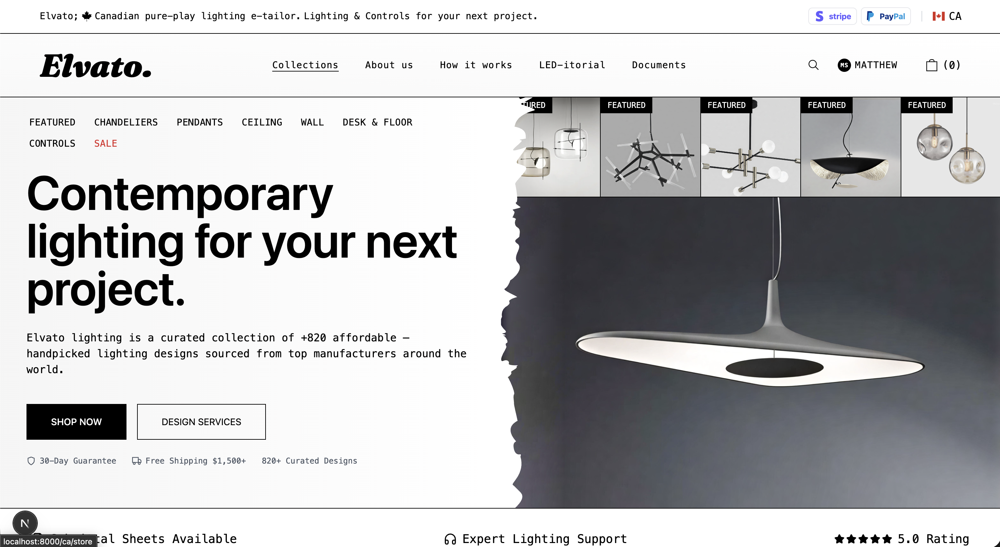

# Elvato

## Architecture Overview

Elvato is a headless commerce system built on `Medusa.js` with a `Next.js` storefront, designed as a decoupled service mesh where commerce logic, web delivery, media distribution, and payments are isolated and independently scalable.

### Platform Composition
- **Commerce framework:** `Medusa.js` provides catalog, cart, checkout, order, and admin domain logic.
- **Storefront runtime:** `Next.js` application deployed on Vercel.
- **Search engine:** `MeiliSearch` provides full-text product search, category filtering, and price sorting.
- **Payment provider:** Stripe handles payment authorization, capture, and webhook-driven reconciliation.

### Production Topology
- **Storefront edge endpoint:** Vercel hosts the production storefront at `https://elvato.shop`.
- **Core commerce origin:** Railway hosts the Medusa backend, including Store API and Admin API surfaces.
- **Admin access path:** `https://admin.elvato.shop` is served via a Vercel front-door and routed to the Railway admin origin at `/app`.
- **Search index:** Railway hosts a self-hosted MeiliSearch v1.12.8 instance at `https://meilisearch-production-3595.up.railway.app`. The Medusa backend indexes products via Railway private networking; the storefront queries via the public endpoint.
- **Persistence layer:** Neon hosts PostgreSQL as the primary transactional datastore for the Medusa backend.
- **Cache and event infrastructure:** Upstash Redis (via Vercel integration) supports caching and event-driven backend workloads.
- **Image pipeline:** Convex manages image metadata and file workflows, with Bunny.net CDN serving optimized storefront media at edge.

### Operational Value
- **Separation of concerns:** Web delivery (Vercel), commerce runtime (Railway), search (MeiliSearch), and data services (Neon/Upstash/Convex) can be scaled and operated independently.
- **Performance profile:** Edge-rendered storefront delivery, sub-100ms typo-tolerant search, and CDN-backed media distribution reduces latency and origin load.
- **Reliability posture:** Managed platforms (Vercel, Railway, Neon, Upstash, Stripe) reduce operational overhead while preserving production-grade observability and elasticity.

### Service Documentation

Detailed documentation for each service is maintained in `.docs/`:

| Service | Documentation |
|---------|---------------|
| Railway Admin Backend | [`.docs/railway-admin-backend.md`](.docs/railway-admin-backend.md) |
| MeiliSearch Product Search | [`.docs/product-index/meilisearch-integration.md`](.docs/product-index/meilisearch-integration.md) |
| Vercel Storefront Deployment | [`.docs/vercel-storefront-deployment.md`](.docs/vercel-storefront-deployment.md) |
| Neon PostgreSQL Database | [`.docs/neon-postgresql-database.md`](.docs/neon-postgresql-database.md) |
| Stripe Payment Processing | [`.docs/stripe-payment-processing.md`](.docs/stripe-payment-processing.md) |
| Convex CDN Image Layer | [`.docs/convex-cdn-image-layer.md`](.docs/convex-cdn-image-layer.md) |